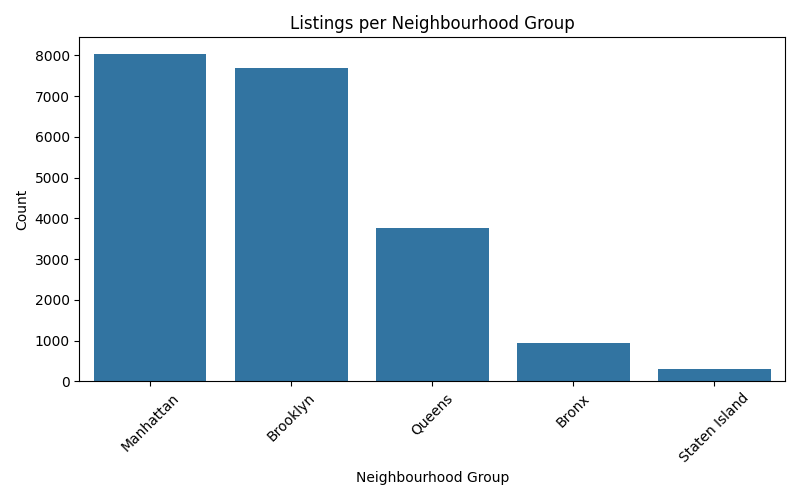
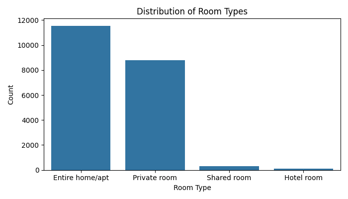
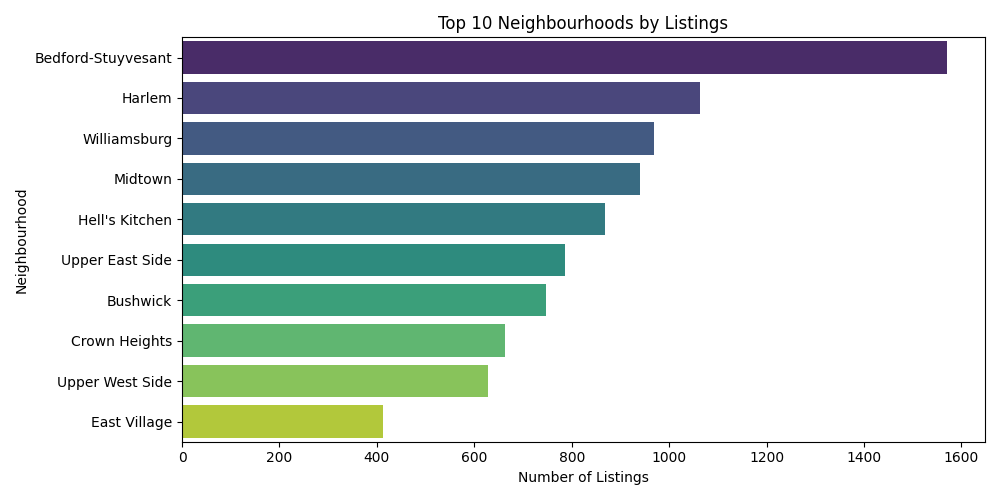
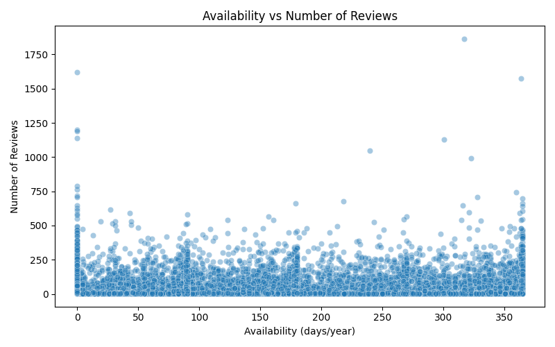

# 🏠 Airbnb New York Listings: Exploratory Data Analysis

A comprehensive data analysis project examining Airbnb listing patterns, pricing dynamics, and neighborhood characteristics across New York City.

---

## 📁 Dataset Overview

The dataset contains Airbnb listings across different neighbourhoods with various details such as price, room type, availability, and number of reviews.

---

## 📊 Exploratory Data Analysis

### ✅ Neighbourhood Group Distribution

### ✅ Room Type Distribution

### ✅ Price Distribution (Under $500)

### ✅ Top 10 Neighbourhoods by Listings

### ✅ Availability vs Number of Reviews

---

## 📈 GroupBy Insights

### 📍 Average Price by Neighbourhood Group

| Neighbourhood Group | Average Price ($) |
|----------------------|-------------------|
| Manhattan            | 227.482034            |
| Brooklyn             | 187.196647            |
| Queens               | 126.521415            |
| Bronx                | 118.780069            |
| Staten Island        | 118.407798            |

### 📍 Average Price & Availability by Room Type

| Room Type        | Average Price ($) | Average Availability (days/year) |
|------------------|-------------------|----------------------------------|
| Entire home/apt  | 222.966381        | 208.725674                       |
| Private room     | 415.053571        | 273.178571                       |
| Shared room      | 139.572566        | 201.012398                       |
| Hotel room       | 156.680412        | 222.759450                       |

> 📌 *Note: All values are approximate and based on cleaned data.*

---

## 🛠 Technology Stack

| Category       | Technologies                                                                 |
|----------------|------------------------------------------------------------------------------|
| **Core**       |   |
| **Visualization** |   |
| **Development** |   |
| **Version Control** |   |

---

## 👨‍💻 Author Profile

)

**Md Rabbi Ali**  
*Data Science Professional | Statistical Analyst*

### 📚 Education
- ** B.Sc & M.Sc in Statistics** - Islamic University, Kushtia

---

## 📜 Licensing Information

**Permissions**  
✔ Commercial Use  
✔ Modification  
✔ Distribution  
✔ Private Use  

**Conditions**  
ℹ License and copyright notice must be included

**Limitations**  
✖ Liability  
✖ Warranty  

---

## 💖 Support This Project

Your support helps me create more open-source content:

**Ways to contribute:**
- ⭐ Star the repository
- 🐞 Report issues
- 💡 Suggest enhancements
- ↗️ Share with your network

---

© 2025 Md Rabbi Ali | All Rights Reserved
