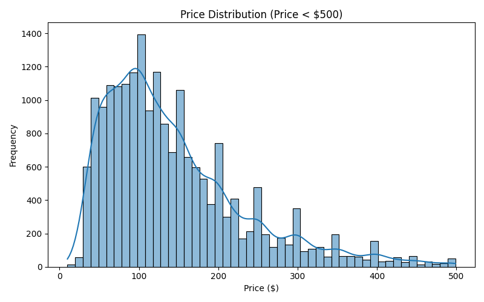

# 🏠 Airbnb New York Listings: Exploratory Data Analysis

A comprehensive data analysis project examining Airbnb listing patterns, pricing dynamics, and neighborhood characteristics across New York City.

---

## 📁 Dataset Overview

The dataset contains Airbnb listings across different neighbourhoods with various details such as price, room type, availability, and number of reviews.

---

## 📊 Exploratory Data Analysis

### ✅ Neighbourhood Group Distribution

### ✅ Room Type Distribution

### ✅ Price Distribution (Under $500)

### ✅ Top 10 Neighbourhoods by Listings

### ✅ Availability vs Number of Reviews

---

## 📈 GroupBy Insights

### 📍 Average Price by Neighbourhood Group

| Neighbourhood Group | Average Price ($) |
|----------------------|-------------------|
| Manhattan            | 227.482034            |
| Brooklyn             | 187.196647            |
| Queens               | 126.521415            |
| Bronx                | 118.780069            |
| Staten Island        | 118.407798            |

### 📍 Average Price & Availability by Room Type

| Room Type        | Average Price ($) | Average Availability (days/year) |
|------------------|-------------------|----------------------------------|
| Entire home/apt  | 222.966381        | 208.725674                       |
| Private room     | 415.053571        | 273.178571                       |
| Shared room      | 139.572566        | 201.012398                       |
| Hotel room       | 156.680412        | 222.759450                       |

> 📌 *Note: All values are approximate and based on cleaned data.*

---

## 🛠 Technologies Used

- Python 🐍
- Pandas 📊
- Matplotlib 📈
- Seaborn 🌊
- VS Code 💻

--- 

---

---

## 👨‍💻 Author

**Md Rabbi Ali**  
🎓 *B.Sc & M.Sc in Statistics*, Islamic University  
💼 *Junior Data Analyst*  
🛠️ Skills: `Python` • `Power BI` • `Excel` • `SQL`  
📬 **Email:** [rabbi.stat.iu@gmail.com](mailto:rabbi.stat.iu@gmail.com)  
🌐 **GitHub:** [RabbiTheAnalyst](https://github.com/RabbiTheAnalyst)

---

## 📄 License

This project is licensed under the **MIT License**.  
You are free to use, modify, and distribute with proper attribution.

> © 2025 Md Rabbi Ali – All Rights Reserved

---

## 🙏 Acknowledgements

- 🙌 Special thanks to **Airbnb** for providing open access datasets  
- 💡 Inspired by the amazing **Data Science & EDA Community**  
- 📁 This project is a proud part of my **portfolio-building journey**

---

## ⭐ Support

If you find this project insightful or useful:

> ✅ **Please consider giving it a star on GitHub!**  
> It helps others discover this project and supports my work.

---

